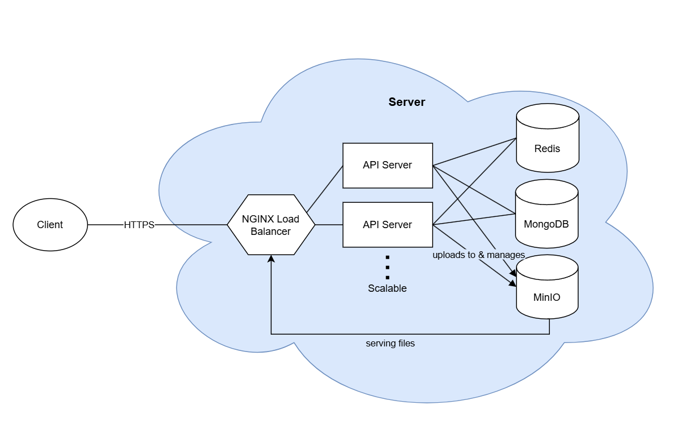

# The Jade Trail

Welcome to Jade Trail, a privacy-first, secure marketplace and messaging 
platform with minimal data retention and end-to-end encrypted messaging.

[](https://nextjs.org/)

## Disclaimer 

This website was created to fulfill the requirements of a software engineering
course. 
The authors of this website **DO NOT GUARANTEE** the fitness of this website for
any particular purpose. 
In no event shall the authors be liable for any claim, damages, or other 
liability incurred by the use of this website. Do not perform any illegal 
activities on this website.

As part of this coursework, a 
* Software Requirements and Specifications, 
* Design and Implementation, 
* Testing Strategy, and 
* User Manual & Release Notes 

document were submitted but not included in this repository. These documents hold more details about this project.

## Table of Contents

- [The Jade Trail](#the-jade-trail)
	- [Disclaimer](#disclaimer)
	- [Table of Contents](#table-of-contents)
	- [Features](#features)
	- [System Architecture](#system-architecture)
	- [Prerequisites](#prerequisites)
	- [Folder Structure](#folder-structure)
	- [Development Setup](#development-setup)
	- [Deployment](#deployment)
	- [Available Scripts](#available-scripts)
	- [Testing](#testing)
	- [Environment Variables](#environment-variables)
	- [Troubleshooting](#troubleshooting)
	- [Contributing](#contributing)
	- [License](#license)


## Features

- **Authentication**: Secure sign-up, sign-in, token-based session management.
- **End-to-end Encrypted Chat**: Real-time messaging with strict password-based encryption.
- **Marketplace**: List, browse, and purchase


## System Architecture




- **Frontend:** Next.js, React, Tailwind CSS, TypeScript
- **API Server:** Next.js API Routes (Node.js, Express-style REST handlers)
- **Database:** MongoDB
- **Cache:** Redis
- **Object Storage:** MinIO
- **Reverse Proxy and Load Balancing:** Nginx
- **Testing:** Jest
- **Containerization:** Docker, Docker Compose


## Prerequisites

- Node.js (>= 20)
- npm (>= 8)
- Docker & Docker Compose
- Git


## Folder Structure

```text
├── public/                  # Static assets
├── src/
│   ├── pages/               # Next.js pages & API routes
│   ├── components/          # React UI components
│   ├── data/                
│   │   ├── api/             # Database queries and schemas
│   │   └── frontend/        # Frontend API calls
│   │       ├── fetches/     # HTTP requests
│   │       ├── queries/     # Data retrieval post-processing
│   │       └── mutations/   # Data transmission pre-processing
│   ├── hooks/               # Custom React hooks
│   ├── layouts/             # Layout wrappers
│   ├── utils/               # Utility functions
│   ├── styles/              # Global & module CSS
│   └── types/               # Shared TypeScript types
├── __tests__/               # Unit & integration tests
├── docker-compose.yaml      # Production Docker Compose
├── docker-compose.dev.yaml  # Development Docker Compose
├── ...                      # Other config files
└── README.md
``` 


## Development Setup

1. **Clone the repository**

   ```bash
   git clone https://github.com/iBlueDust/csci3100-group-project.git jadetrail
   cd jadetrail
   ```

2. **Set up environment variables**

   Copy `.env.example` to `.env` and fill in your credentials:
   ```bash
   cp .env.example .env.local
   ```

	 Also ensure `.env.local` exists:
	 ```bash
	 touch .env.local
	 ```

	 Last, define valid license keys in `.licenses`. This file must be created to
	 run the app.
	 ```bash
	 echo XXXX-XXXX-XXXX-XXXX > .licenses
	 ```
	 More license keys can also be specified as a string in the format XXXX-XXXX-XXXX-XXXX, each key being on separate lines in the file. Note that letters 0, O, 1, and I are forbidden from use in license keys.
	

3. **Start services and Next.JS server in dev mode**

   ```bash
   npm run dev:start
   ```

   This boots up MongoDB, Redis, MinIO, Nginx, and the Next.js dev server.

4. **Access the application**

   - Frontend: http://localhost:3000
   - API: http://localhost:3000/api

5. **Stop services**

   ```bash
   npm run dev:stop
   ```

## Deployment

1. **Repeat steps 1-2 in [Development Setup](#development-setup)**
2. **Start all services in production mode**

	 ```bash
	 docker compose up -d
	 ```

## Available Scripts

Inside the project directory, run:

- `npm install`        Install dependencies
- `npm run dev`        Start Next.js server only in development mode
- `npm run dev:start`        Start Next.js server and all backend services (MongoDB, MinIO, Redis) in development mode
- `npm run dev:stop`        Stops all backend services (MongoDB, MinIO, Redis)
- `dev.sh`				Start Next.js server and all backend services, and terminate all upon SIGTERM
- `npm run build`      Build for production
- `npm run start`      Start production server
- `npm run lint`       Run ESLint
- `npm run test`       Run all Jest tests


## Testing

`npm run test` (Jest)


## Environment Variables

See [`.env.example`](.env.example) for required environment variables.


## Troubleshooting

- **Mongo Init Script Not Running**
  1. `docker-compose down`
  2. Remove `./data` folder (**WIPES THE DATABASE**)
  3. `docker-compose up --build`

- **Ports in Use**: Ensure ports 3000, 27017, 6379, 9000 are free.


## Contributing

1. Fork the repository
2. Create a feature branch
3. Commit your changes
4. Open a Pull Request


## License

This project is licensed under the [Creative Commons BY-NC-ND 4.0](https://creativecommons.org/licenses/by-nc-nd/4.0/) license. See [LICENSE](LICENSE) for details.